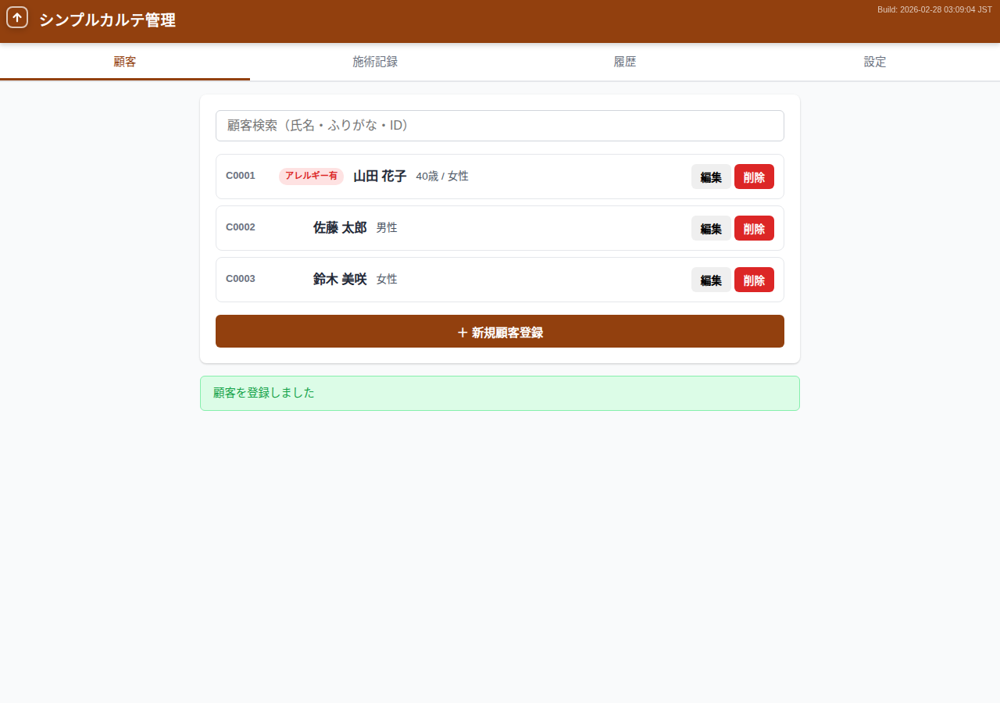
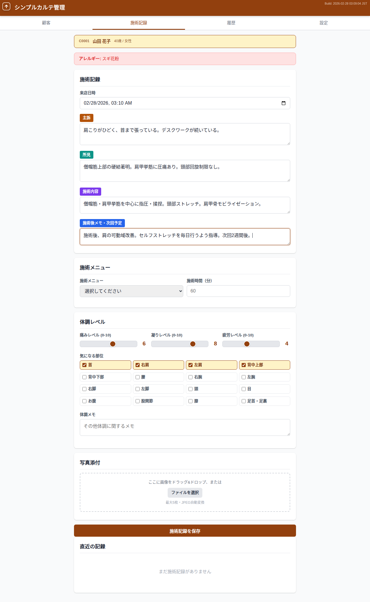
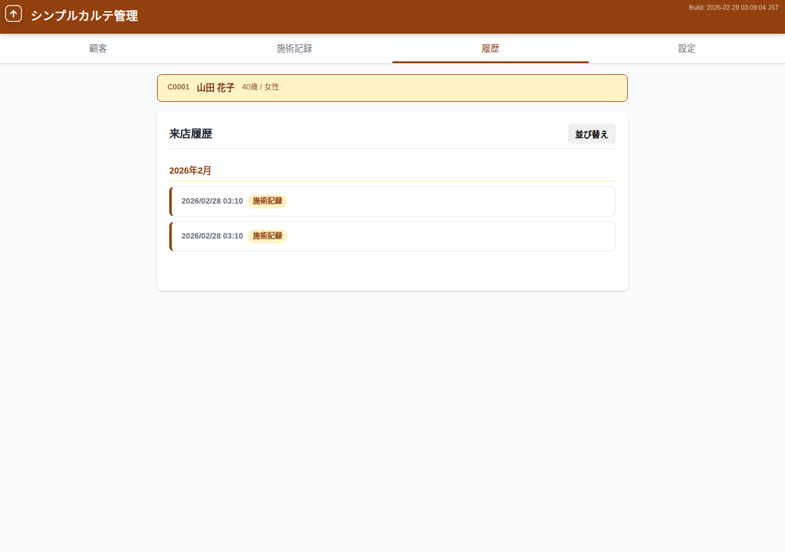

# smrm — シンプルカルテ管理

**紙のカルテはもう不要。ブラウザだけで、今日から使えるカルテ管理。**

個人サロン・治療院（マッサージ・整体・鍼灸・エステ等）向けに設計された、完全無料のブラウザ完結型カルテ管理アプリケーションです。
サーバー不要、インストール不要。ブラウザを開くだけで使い始められます。

---

## なぜ smrm？

小規模サロン・治療院にとって、カルテ管理システムは「高すぎる・複雑すぎる・大げさすぎる」。
smrm は、紙カルテの手軽さとデジタルの便利さを両立するために作られました。

- **サーバー不要** — データはお使いの端末内（ブラウザ）に保存。外部に送信されません
- **月額 0 円** — ずっと無料で使えます
- **3 分で開始** — アカウント登録不要。ブラウザでアクセスすれば即利用開始

---

## 主な機能

### 顧客管理

顧客情報の登録・検索・編集をシンプルな画面で。
顧客コードの自動採番、ふりがな検索、アレルギー・既往歴の管理にも対応しています。
顧客詳細の読み取り専用表示で、施術中でもワンタップで顧客情報を確認できます。



### 施術記録

主訴・所見・施術内容・施術後メモを記録。
体調レベル（痛み・凝り・疲労）のスライダー入力、施術メニュー選択、写真添付にも対応しています。



### 訪問履歴タイムライン

施術記録を時系列で一覧表示。
顧客ごとの来店の流れをひと目で把握できます。



### その他の機能

- **施術メニュー管理** — メニュー名とデフォルト時間を設定、ドロップダウンから選択
- **写真添付** — 顧客・施術記録に最大5枚、ドラッグ&ドロップ対応、JPEG自動変換
- **データエクスポート/インポート** — JSON形式でバックアップ・復元・他端末への移行
- **表示設定** — 使わないフィールドを非表示にしてUIをカスタマイズ
- **画像圧縮設定** — 高画質/標準/容量節約の3プリセットから選択

---

## サンプルデータ

デモや動作確認用に、リアルなサンプルデータを用意しています。

| 項目 | 件数 |
|------|------|
| 顧客 | 100人 |
| 施術記録 | 10,000件 |
| メディア（写真） | 約2,000件 |

アプリの設定タブから「サンプルインポート」ボタンを押すだけで、すぐにデモ環境を構築できます。

<details>
<summary>含まれるデータの詳細</summary>

- **顧客**: 18〜80歳の幅広い年齢層、男女均等、アレルギー情報・既往歴・紹介元・来店動機付き
- **施術記録**: 30種類の主訴・所見・施術内容テンプレート、体調レベル・施術メニュー・気になる部位付き
- **メディア**: 顧客の30%にプロフィール画像、施術記録の20%に施術画像（SVG形式）

</details>

サンプルデータの再生成:

```bash
node tools/generate_sample_data.js
```

---

## smrm の特徴

| | |
|---|---|
| **完全オフライン対応** | インターネット接続なしで動作。PWA としてホーム画面に追加可能 |
| **プライバシー保護** | 顧客データは端末内の IndexedDB に保存。サーバーへの送信は一切なし |
| **データポータビリティ** | JSON エクスポートでバックアップ。端末の移行もファイル1つで完了 |
| **マルチデバイス** | PC・タブレット・スマートフォンに対応したレスポンシブデザイン |

---

## 開発者向け情報

### 技術スタック

| 項目 | 技術 |
|------|------|
| フロントエンド | HTML + vanilla JavaScript (SPA) |
| データストア | IndexedDB |
| PWA | Web App Manifest + Service Worker |
| コンテナ | Docker (nginx:alpine / node:alpine) |
| テスト | Jest (単体テスト) + Puppeteer (E2Eテスト) |

### セットアップ（ローカル開発）

```bash
# Docker でビルド＆起動（ポート 8086）
bash scripts/build.sh

# 強制リビルド
bash scripts/rebuild.sh
```

### テスト

```bash
# 単体テスト
npm test

# E2Eテスト（Docker内で実行）
docker compose run --rm smrm-test
```

---

## ドキュメント

| ドキュメント | 内容 |
|-------------|------|
| [要件定義書](docs/requirements_definition.md) | 機能要件・非機能要件 |
| [基本設計書](docs/basic_design.md) | アーキテクチャ・データモデル・画面設計 |
| [詳細設計書](docs/detailed_design.md) | CRUD操作・バリデーション・メディア処理 |
| [アルゴリズム・ロジック仕様](docs/algorithm_logic.md) | 計算ロジック・アルゴリズム詳細 |
| [テスト仕様書](docs/test_specification.md) | 単体テスト・E2Eテスト仕様 |
| [テスト期待結果](docs/test_expected.md) | テスト入出力一覧 |
| [ユーザーマニュアル](docs/manual.md) | 操作手順・画面説明 |

---

## ライセンス

[MIT License](LICENSE)
