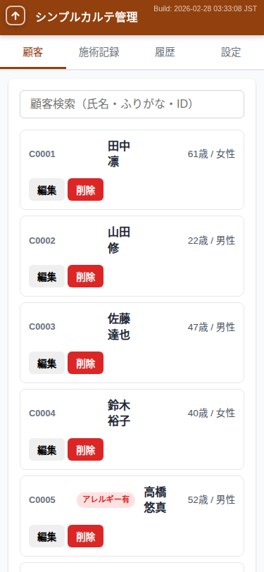
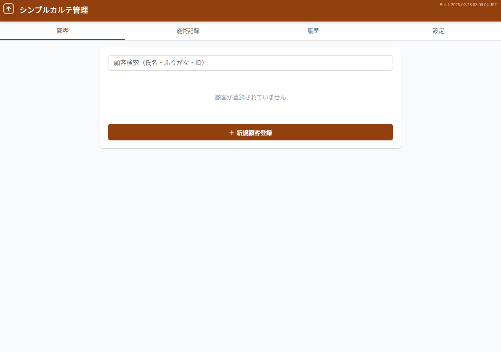
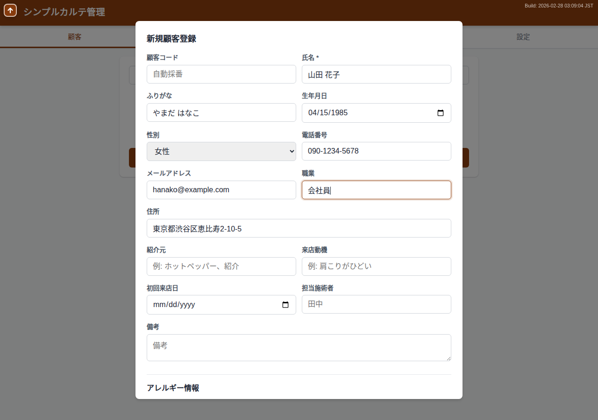
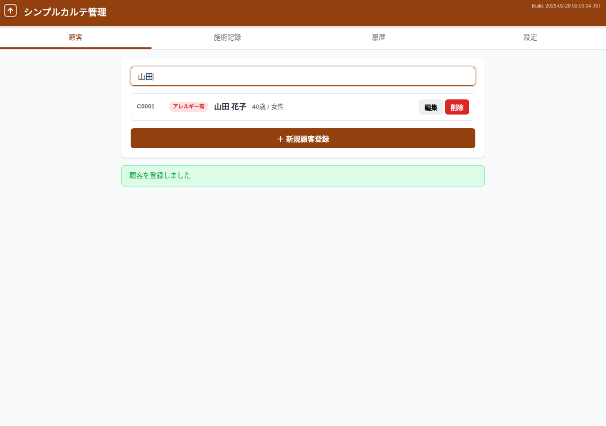
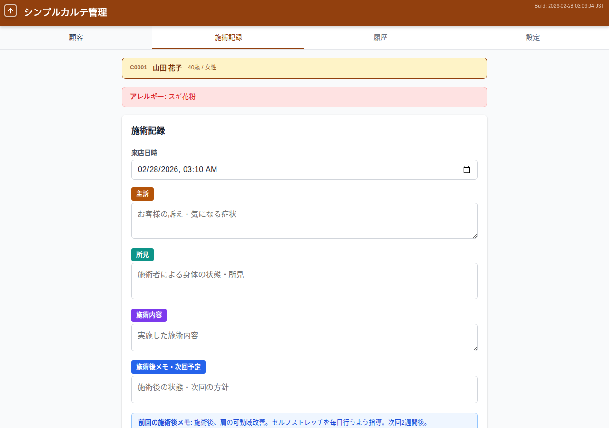
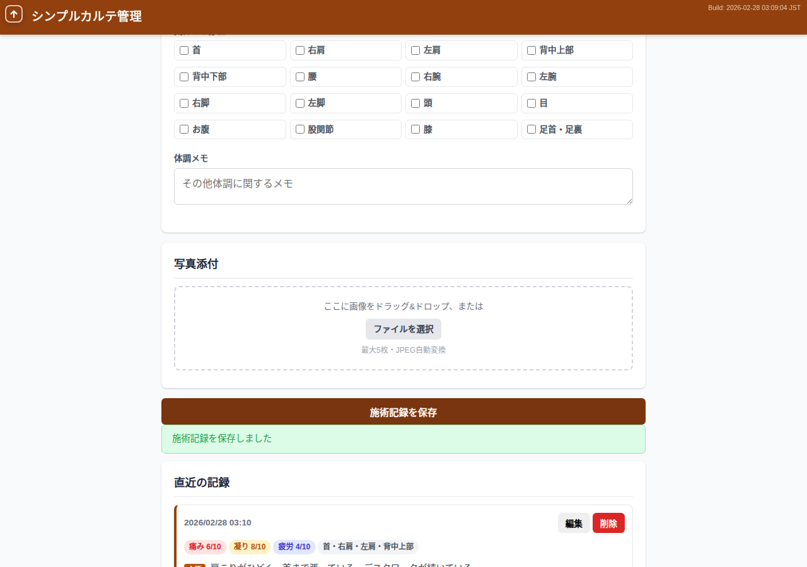
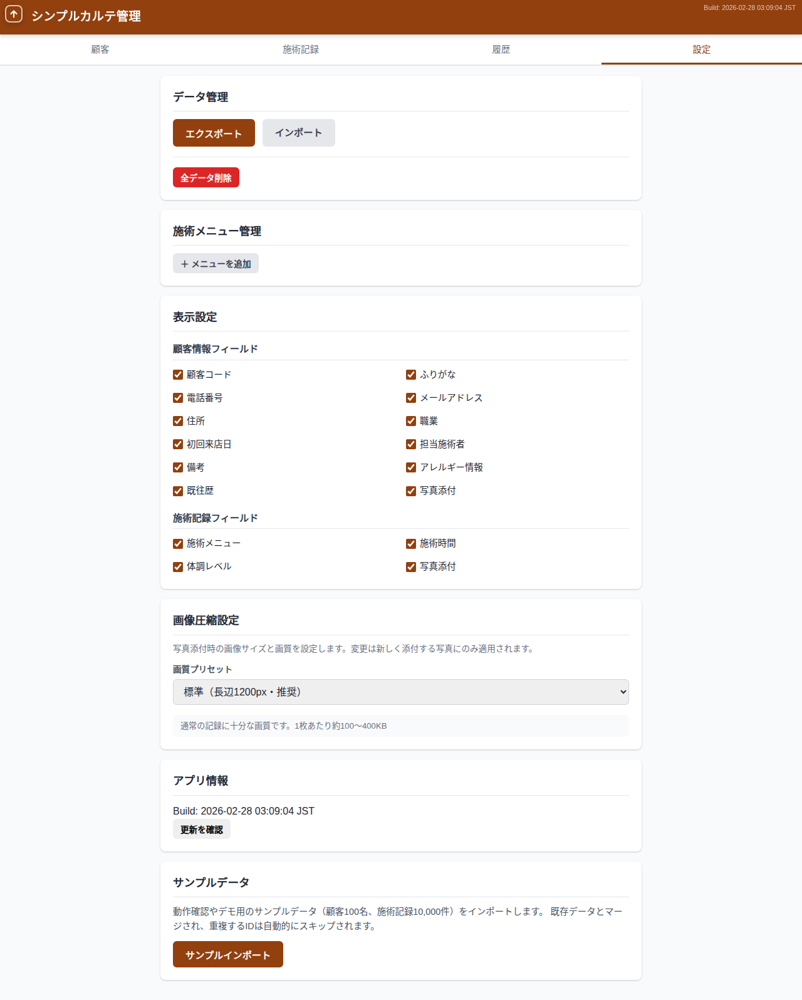
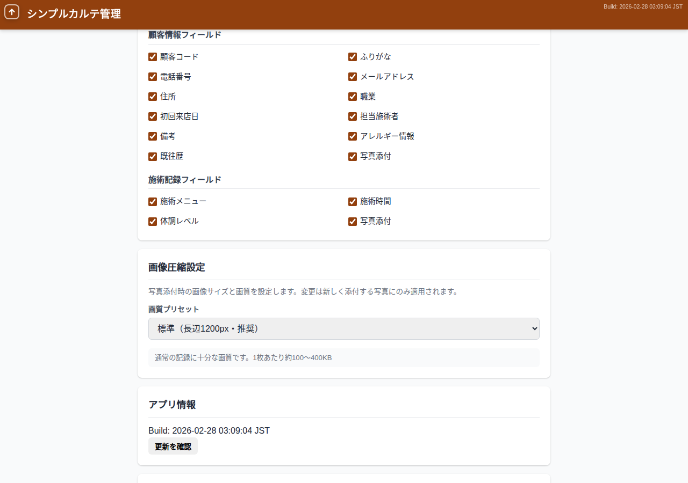
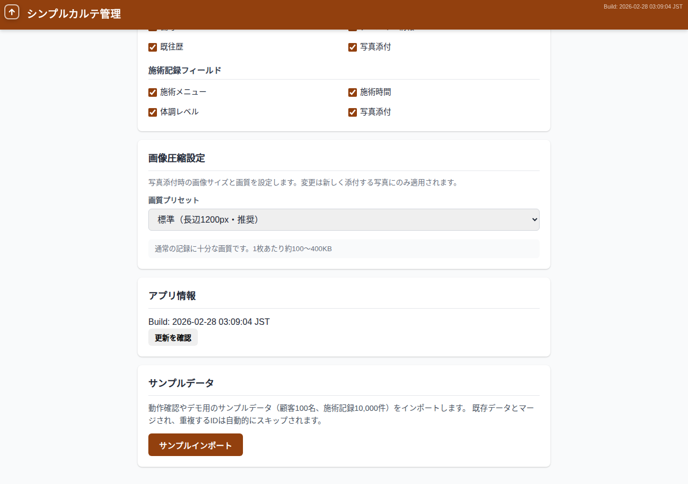

# ユーザーマニュアル — シンプルカルテ管理 (smrm)

## 目次

1. [はじめに](#1-はじめに)
2. [画面構成](#2-画面構成)
3. [顧客管理](#3-顧客管理)
4. [施術記録](#4-施術記録)
5. [訪問履歴](#5-訪問履歴)
6. [設定](#6-設定)
7. [データの保存について](#7-データの保存について)

---

## 1. はじめに

### 1.1 smrm とは

「シンプルカルテ管理（smrm）」は、個人サロン・治療院向けのブラウザ完結型カルテ管理アプリケーションです。
マッサージ・整体・鍼灸・エステなどの施術院で、顧客情報と施術記録を手軽に管理できます。

### 1.2 特徴

- **ブラウザだけで動作** — アプリのインストールは不要です
- **サーバー不要** — データはお使いの端末内に保存されます
- **オフライン対応** — インターネット接続なしでも使用できます
- **無料** — 月額費用はかかりません

### 1.3 動作環境

- Google Chrome（推奨）
- Firefox
- Safari
- Microsoft Edge

スマートフォン・タブレット・PCのいずれでも利用可能です。

| PC表示 | モバイル表示 |
|--------|-----------|
|  |  |

---

## 2. 画面構成

アプリは4つのタブで構成されています。画面上部のタブボタンで切り替えます。

| タブ | 内容 |
|------|------|
| **顧客** | 顧客の検索・一覧表示・新規登録 |
| **施術記録** | 選択した顧客の施術記録を入力 |
| **履歴** | 選択した顧客の来店履歴をタイムラインで表示 |
| **設定** | データ管理・表示設定・アプリ情報 |

### 共通UI要素

- **左上のボタン（↑）**: ページの一番上にスクロールします
- **右上の表示**: アプリのバージョン情報を表示しています
- **ヘッダー（「シンプルカルテ管理」）**: クリックするとページの一番上に戻ります

---

## 3. 顧客管理

### 3.1 新規顧客登録

1. 「顧客」タブを開きます
2. 画面下部の「＋ 新規顧客登録」ボタンをタップします
3. 登録フォームが表示されます
4. 必要な情報を入力します
   - **氏名**（必須）
   - ふりがな
   - 生年月日
   - 性別
   - 電話番号
   - メールアドレス
   - 住所
   - 職業
   - 紹介元・来店動機
   - 初回来店日・担当施術者
   - 備考
   - アレルギー情報
   - 既往歴
   - 写真
5. 「保存」ボタンをタップして登録完了です

**顧客コード**は自動で採番されます（C0001, C0002, ...）。手動で入力することもできます。

### 3.2 顧客一覧・検索

顧客タブには登録済みの全顧客がカード形式で表示されます。
各カードには顧客名・顧客コードに加え、写真が登録されている場合はサムネイル、未登録の場合は氏名の先頭1文字（イニシャル）が表示されます。
カードには「詳細」「編集」「削除」ボタンがあり、「詳細」ボタンをタップすると顧客情報を読み取り専用で確認できます。

**検索方法**:
- 検索バーに氏名・ふりがな・顧客コードを入力すると、リアルタイムで絞り込まれます
- 部分一致で検索できます（例: 「田中」で「田中太郎」「田中花子」がヒット）

### 3.3 顧客編集

1. 顧客カード内の「編集」ボタンをタップします
2. 登録時と同じフォームが開きます
3. 情報を修正して「保存」をタップします

### 3.4 顧客削除

1. 顧客カード内の「削除」ボタンをタップします
2. 確認ダイアログが表示されます
3. 「実行」をタップすると削除されます

**注意**: 削除すると、その顧客に紐づく施術記録と写真もすべて削除されます。

### 3.5 アレルギー情報の登録

1. 顧客登録/編集フォームの「アレルギー情報」セクションを開きます
2. 「＋ アレルギーを追加」ボタンをタップします
3. アレルゲン名・重症度・備考を入力します
4. 複数のアレルギーを追加できます

アレルギーが登録されている顧客を選択すると、施術記録タブに**警告バー**が表示されます。

### 3.6 既往歴の登録

1. 顧客登録/編集フォームの「既往歴」セクションを開きます
2. 「＋ 既往歴を追加」ボタンをタップします
3. 疾患名・備考を入力します

### 3.7 顧客詳細の表示

登録済みの顧客情報を、編集せずに確認したい場合に使います。

**開き方**（3つの方法）:

1. **顧客カードの「詳細」ボタン**: 顧客タブのカードにある「詳細」ボタンをタップ
2. **施術記録タブの顧客情報バー**: 施術記録タブ上部の顧客名が表示されているバーをタップ
3. **履歴タブの顧客情報バー**: 履歴タブ上部の顧客名が表示されているバーをタップ

**表示される情報**:

- 基本情報（顧客コード、氏名、ふりがな、生年月日・年齢、性別）
- 連絡先（電話番号、メール、住所）
- 来店情報（職業、紹介元、来店動機、初回来店日、担当施術者）
- 備考
- アレルギー情報
- 既往歴
- 登録済み写真
- 登録日・更新日

**操作ボタン**:

- **閉じる**: 詳細画面を閉じます
- **編集**: 詳細画面を閉じて、編集フォームを開きます

---

## 4. 施術記録

### 4.1 施術記録の入力手順

1. 「顧客」タブで顧客カードをタップして選択します
2. 自動的に「施術記録」タブに切り替わります

> **ヒント**: 施術記録タブや履歴タブの上部にある顧客情報バーをタップすると、顧客詳細をすぐに確認できます。施術中に顧客情報を参照したい場合に便利です。

3. 以下の情報を入力します

#### 基本情報

- **来店日時**: デフォルトで現在日時が設定されます。変更も可能です

#### 施術内容（4つのテキストエリア）

- **主訴**: お客様の訴え・気になる症状
- **所見**: 施術者による身体の状態・所見
- **施術内容**: 実施した施術内容
- **施術後メモ・次回予定**: 施術後の状態・次回の方針

※ 4つのうち**いずれか1つ以上**を入力すれば保存できます。

#### 前回施術後メモの参照

前回の施術記録に「施術後メモ」がある場合、フォーム下部にヒントとして表示されます。施術の継続性を確認する際に便利です。

#### 施術メニュー・時間

- **施術メニュー**: 設定タブで登録したメニューから選択します
- **施術時間（分）**: メニューを選択すると、デフォルトの施術時間が自動入力されます

### 4.2 体調レベルの記録

施術記録には、お客様の体調レベルを記録できます。

- **痛みレベル** (0〜10): スライダーで入力
- **凝りレベル** (0〜10): スライダーで入力
- **疲労レベル** (0〜10): スライダーで入力
- **気になる部位**: チェックボックスで複数選択（首、右肩、左肩、背中上部、背中下部、腰、右腕、左腕、右脚、左脚、頭、目、お腹、股関節、膝、足首・足裏）
- **体調メモ**: その他のメモ

### 4.3 写真添付

施術記録に写真を添付できます（最大5枚）。

**添付方法**:
- 「ファイルを選択」ボタンから画像ファイルを選択
- ドラッグ&ドロップで画像を添付

**仕様**:
- すべての画像はJPEG形式に自動変換されます
- 画像サイズは設定に応じて自動リサイズされます
- サムネイルが一覧表示されます
- サムネイルをタップすると拡大表示されます

### 4.4 施術記録の保存

1. 必要な情報を入力したら「施術記録を保存」ボタンをタップします
2. 保存成功メッセージが表示されます
3. 「直近の記録」セクションに保存した記録が表示されます

### 4.5 施術記録の編集・削除

- 「履歴」タブのタイムラインから各記録を編集・削除できます

---

## 5. 訪問履歴

### 5.1 タイムライン表示

1. 「顧客」タブで顧客を選択した後、「履歴」タブを開きます
2. 選択した顧客の施術記録がタイムライン形式で表示されます

各記録には以下の情報が表示されます:
- 来店日時
- 主訴・所見・施術内容・施術後メモ
- 施術メニュー・時間
- 体調レベル
- 添付写真

### 5.2 並び替え

「並び替え」ボタンで表示順を切り替えられます:
- **新しい順**（デフォルト）
- **古い順**

### 5.3 ページネーション

1ページあたり20件ずつ表示されます。ページ切り替えボタンで前後のページに移動できます。

---

## 6. 設定

### 6.1 データ管理

#### エクスポート（バックアップ）

1. 「設定」タブを開きます
2. 「エクスポート」ボタンをタップします
3. JSON形式のバックアップファイルがダウンロードされます

ファイル名: `smrm_backup_YYYYMMDD_HHMMSS.json`

**定期的なバックアップを推奨します。**

#### インポート（復元）

1. 「設定」タブを開きます
2. 「インポート」ボタンをタップし、バックアップファイルを選択します
3. データが読み込まれ、既存データとマージされます

- 同じIDのデータは重複せずスキップされます
- 施術メニューは名前が同じものはスキップされます

#### 全データ削除

1. 「全データ削除」ボタンをタップします
2. 確認ダイアログが表示されます
3. 「実行」をタップすると、すべてのデータが削除されます

**注意**: 削除されたデータは復元できません。事前にエクスポートすることを推奨します。

### 6.2 施術メニュー管理

施術記録で選択するメニューを管理します。

1. 「設定」タブの「施術メニュー管理」セクションを開きます
2. 「＋ メニューを追加」ボタンでメニューを追加します
3. メニュー名とデフォルト施術時間を入力します
4. 入力は自動保存されます

### 6.3 表示設定

使用しないフィールドを非表示にして、画面をシンプルにできます。

**顧客情報フィールド（12項目）**:
顧客コード、ふりがな、電話番号、メールアドレス、住所、職業、初回来店日、担当施術者、備考、アレルギー情報、既往歴、写真添付

**施術記録フィールド（4項目）**:
施術メニュー、施術時間、体調レベル、写真添付

チェックを外すと、対応するフィールドが各画面で非表示になります。

### 6.4 画像圧縮設定

写真添付時の画質を3つのプリセットから選択できます。

| プリセット | 特徴 | おすすめ |
|-----------|------|---------|
| **高画質** | 長辺2048px・高品質。1枚あたり約300〜800KB | 肌の状態など詳細な記録が必要な場合 |
| **標準**（デフォルト） | 長辺1200px。1枚あたり約100〜400KB | 通常の記録 |
| **容量節約** | 長辺800px・軽量。1枚あたり約50〜200KB | ストレージ容量を節約したい場合 |

※ 設定変更は新しく添付する写真にのみ適用されます。既存の写真には影響しません。

### 6.5 アプリ情報

- アプリのバージョンとビルド日時が表示されます
- 「更新を確認」ボタンで、新しいバージョンが利用可能か確認できます
- 新しいバージョンがある場合、画面上部にバナーが表示されます

### 6.6 サンプルデータ

「サンプルインポート」ボタンで、デモ用のサンプルデータ（顧客100名、施術記録10,000件）をインポートできます。動作確認やデモに便利です。

---

## 7. データの保存について

### 7.1 保存場所

すべてのデータは、お使いのブラウザ内（IndexedDB）に保存されます。外部のサーバーに送信されることはありません。

### 7.2 データの永続性

- ブラウザを閉じてもデータは保持されます
- ただし、ブラウザのキャッシュクリアやデータ削除を行うと、データが失われる場合があります

### 7.3 バックアップの重要性

データの紛失を防ぐため、定期的にエクスポート（バックアップ）を行うことを推奨します。

**推奨バックアップ頻度**: 週1回以上

### 7.4 端末の移行

他の端末にデータを移行する場合:

1. 移行元の端末でエクスポートを実行
2. エクスポートされたJSONファイルを移行先の端末に転送
3. 移行先の端末でインポートを実行

### 7.5 PWA（ホーム画面への追加）

smrm はPWA（Progressive Web App）に対応しています。ブラウザのメニューから「ホーム画面に追加」を選択すると、アプリのようにホーム画面から起動できます。オフライン環境でもすべての機能が利用可能です。
