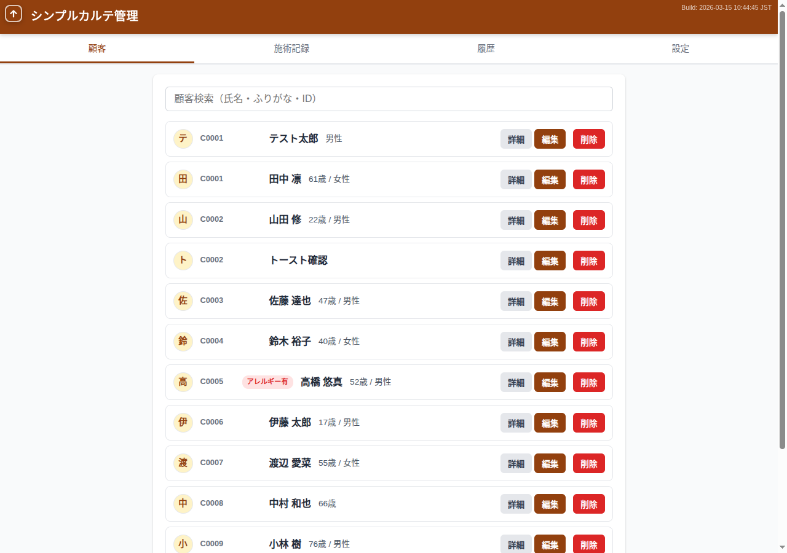
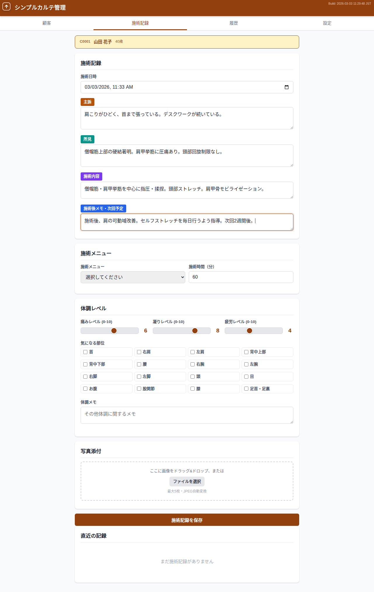
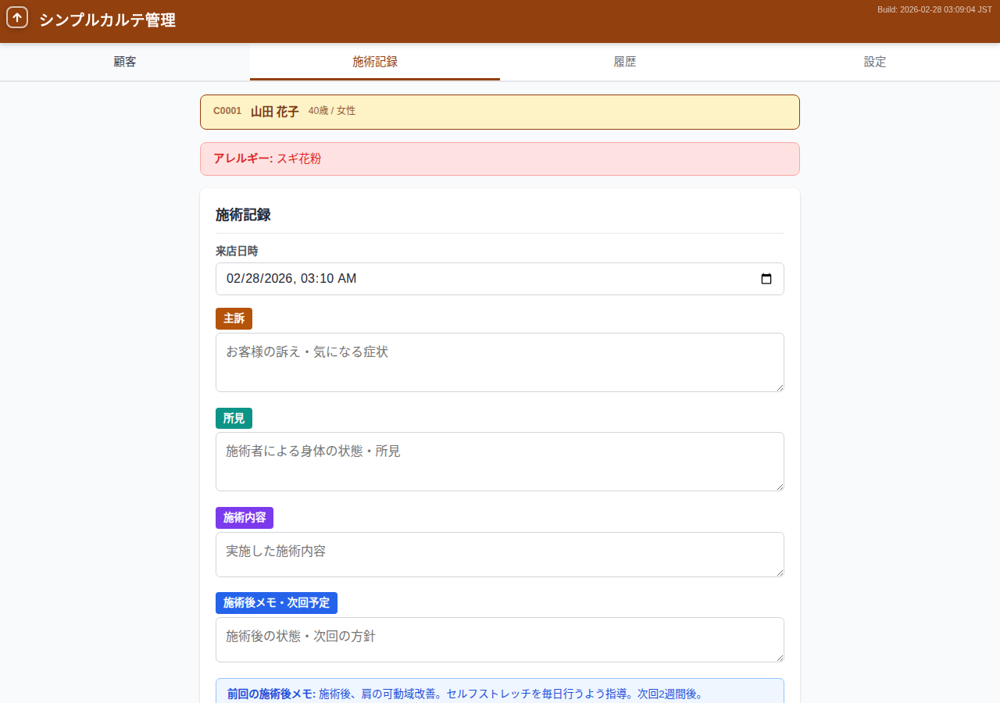
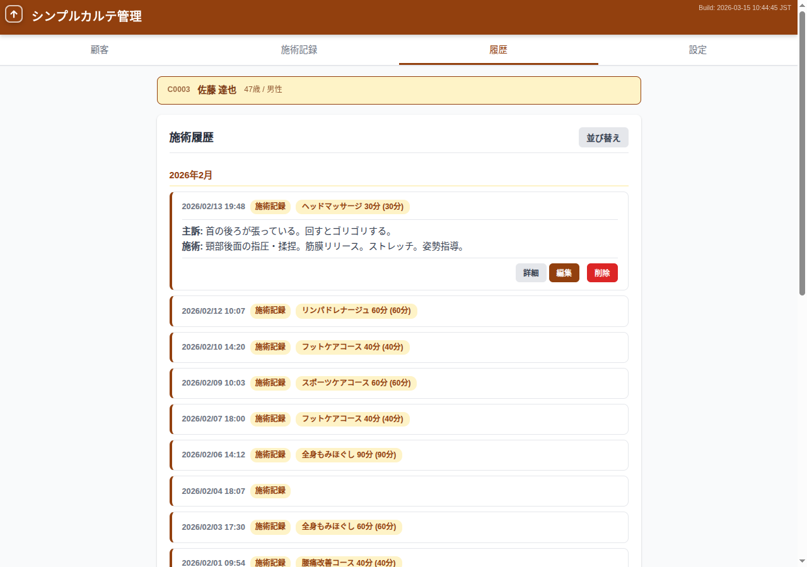
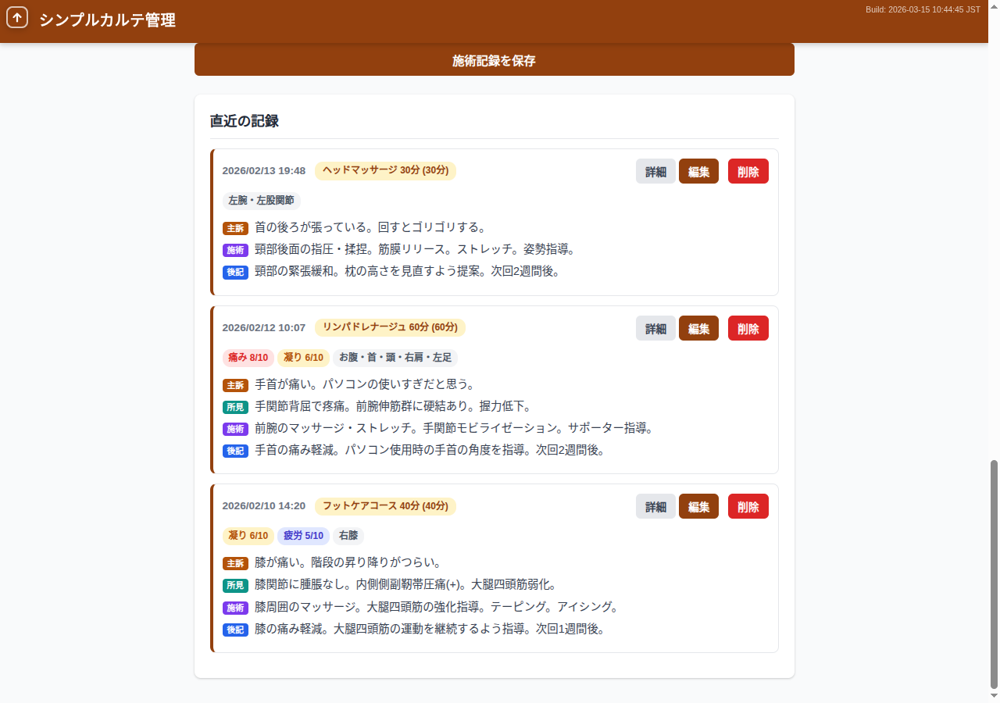
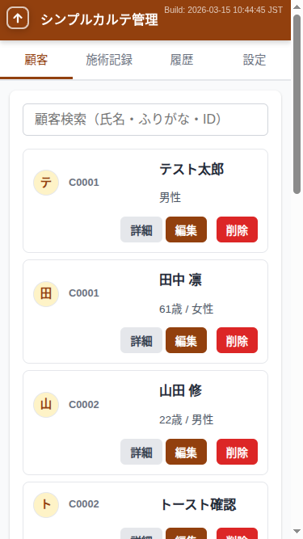
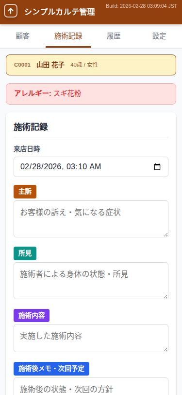
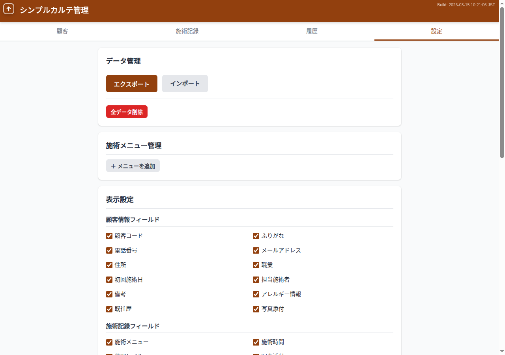
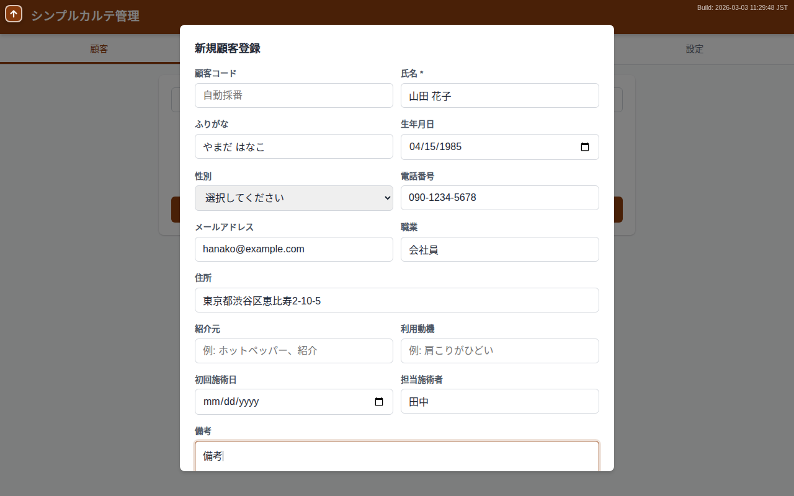

# カルテ管理、まだ紙で消耗してますか？

**月額0円・登録不要・3分で開始。** ブラウザだけで完結する、個人サロン・治療院のためのカルテ管理。

---

## こんなお悩み、ありませんか？

> 「紙カルテが増えて、お客様の情報を探すのに毎回時間がかかる...」

> 「前回の施術内容を思い出せない。カルテに書いたはずだけど、どこだっけ...」

> 「月額数千円の電子カルテサービス、うちの規模には正直もったいない...」

個人サロン・治療院にとって、カルテ管理は**施術の質を支える重要な仕事**。
でも、高額な電子カルテシステムを導入するほどの余裕はない。

紙のカルテを棚から引っ張り出す日々。「このお客様、アレルギーあったっけ？」とヒヤッとする瞬間。
「もっと手軽に、でもちゃんとした電子カルテがあれば——」

**smrm は、そんなあなたのために作りました。**

---

## smrm とは

ブラウザを開くだけで使える、**完全無料**のカルテ管理アプリケーションです。

<table>
<tr>
<td align="center" width="33%">
<h3>💰 ずっと無料</h3>
月額0円。隠れた課金もありません。 小さなサロンの利益を圧迫しません。
</td>
<td align="center" width="33%">
<h3>✨ かんたん操作</h3>
アカウント登録不要。 ブラウザを開いて3分で最初のカルテが完成。
</td>
<td align="center" width="33%">
<h3>🔒 安心・安全</h3>
データはお使いの端末内に保存。 サーバーへの送信は一切ありません。
</td>
</tr>
</table>

---

## 主な機能

### 顧客情報をしっかり管理

氏名・連絡先はもちろん、アレルギー情報・既往歴・写真まで——
お客様ひとりひとりの情報を、**ひとつの画面で一元管理**できます。

顧客コードの自動採番で、管理もラクラク。ふりがな・氏名・コードで即座に検索できます。

---

### 施術記録をスムーズに入力

主訴・所見・施術内容・施術後メモの4つのテキストエリアで、**施術の流れに沿って自然に記録**。
施術メニューを選べばデフォルト時間が自動入力。前回の施術後メモもヒントとして表示されます。

手書きカルテの読み間違いや記入漏れから解放されましょう。

---

### アレルギー警告で安全な施術を

お客様にアレルギー情報が登録されている場合、施術記録タブを開いた瞬間に**警告バーが自動表示**。
大切なお客様の安全を守るための、見落とし防止機能です。

---

### 施術履歴をタイムラインで一覧

お客様ごとの施術記録を時系列で表示。**過去の施術内容・体調の変化を一目で把握**できます。
体調レベル（痛み・凝り・疲労）の推移も確認でき、施術方針の判断に役立ちます。

---

### 写真で施術経過を記録

顧客情報・施術記録に**写真を最大5枚添付**できます。
ドラッグ&ドロップにも対応。画像は自動でリサイズ・圧縮されるので、容量の心配も不要です。

---

### スマホでもサクサク操作

施術の合間にスマートフォンからカルテの確認・入力が可能。
PCと同じ機能を、レスポンシブデザインで快適に使えます。

---

## 選ばれる理由

| 比較項目 | 紙カルテ | 有料電子カルテ | smrm |
|---------|---------|--------------|------|
| **料金** | 用紙・ファイル代 | 月額3,000〜10,000円 | **無料** |
| **導入の手軽さ** | すぐ使える | アカウント登録・初期設定 | **ブラウザで即開始** |
| **検索性** | 手作業で探す | ○ | **○（リアルタイム検索）** |
| **アレルギー警告** | 目視で確認 | △（サービスによる） | **○（自動警告）** |
| **施術履歴の把握** | カルテを1枚ずつ確認 | ○ | **○（タイムライン表示）** |
| **写真記録** | 別途管理が必要 | △（サービスによる） | **○（カルテに直接添付）** |
| **データの安全性** | 紛失・劣化リスク | サーバーに依存 | **端末内で完結** |
| **オフライン利用** | ○ | × | **○** |

---

## こんな方におすすめ

**マッサージ院・整体院の施術者**
前回の主訴・施術内容をすぐに確認。体調レベルの推移を見ながら、一人ひとりに合った施術プランを立てられます。

**鍼灸院の先生**
アレルギー情報の自動警告で、安全な施術をサポート。既往歴も顧客情報に一元管理できます。

**エステサロンのオーナー**
施術前後の写真を記録に添付。お客様への経過説明がスムーズに。施術メニューをマスタ登録すれば、記録入力も効率的です。

**出張施術をされる方**
スマートフォンで出先からカルテを確認・入力。オフラインでも使えるので、電波の届かない場所でも安心です。

**開業したばかりの個人サロン**
初期費用ゼロで電子カルテを導入。お客様が増えてからも、100人・10,000件の施術記録でスムーズに動作します。

---

## セキュリティとプライバシー

<table>
<tr>
<td width="60%">

smrm はあなたのデータを**一切外部に送信しません**。

- すべてのデータは、お使いのブラウザ内（IndexedDB）に保存されます
- サーバーとの通信は、アプリ本体の読み込み時のみ
- インターネット接続がなくても動作します（PWA対応）
- JSON形式でのエクスポートに対応。バックアップや端末移行も安心です

「クラウドに顧客の個人情報を預けるのは不安...」という方にこそ、おすすめです。

</td>
<td width="40%">

</td>
</tr>
</table>

---

## はじめかた — たった3ステップ

### Step 1: アクセスする

ブラウザで smrm を開くだけ。インストールもアカウント登録も不要です。

### Step 2: サンプルデータで体験する

設定タブの「サンプルインポート」で、デモ用データ（顧客100名・施術記録10,000件）をインポートできます。
まずは触って、使い心地を確かめてください。

### Step 3: 最初のお客様を登録して運用開始

「＋ 新規顧客登録」ボタンをタップすれば、すぐに実務で使えます。

---

## よくある質問

**Q. 本当に無料ですか？**
はい、完全無料です。広告表示もありません。オープンソース（MIT License）で公開されています。

**Q. データはどこに保存されますか？**
お使いのブラウザ内（IndexedDB）に保存されます。外部サーバーへの送信は一切行いません。

**Q. オフラインで使えますか？**
はい。PWA（Progressive Web App）対応のため、一度アクセスすればオフラインでも利用できます。ホーム画面に追加すれば、アプリのように起動できます。

**Q. データのバックアップはできますか？**
はい。JSON形式でエクスポート・インポートが可能です。端末の買い替え時にも、ファイル一つでデータを移行できます。

**Q. スマートフォンでも使えますか？**
はい。PC・タブレット・スマートフォンに対応したレスポンシブデザインです。

**Q. 顧客が増えても大丈夫ですか？**
はい。顧客100人、施術記録10,000件でもスムーズに動作するよう設計されています。

**Q. 複数の端末で使えますか？**
データは端末ごとに保存されます。端末間のデータ移行は、エクスポート/インポート機能で行えます。

---

## 今すぐ、無料で始めましょう

紙カルテの管理に費やしていた時間を、**お客様への施術に集中する時間**に変えませんか？

アカウント登録不要。ブラウザを開くだけで、すぐに使い始められます。

[**→ smrm を試してみる**](../local_app/index.html)

使い方を詳しく知りたい方は、[**→ ユーザーマニュアル**](manual.html) をご覧ください。

---

smrm はオープンソースソフトウェアです（MIT License）。
